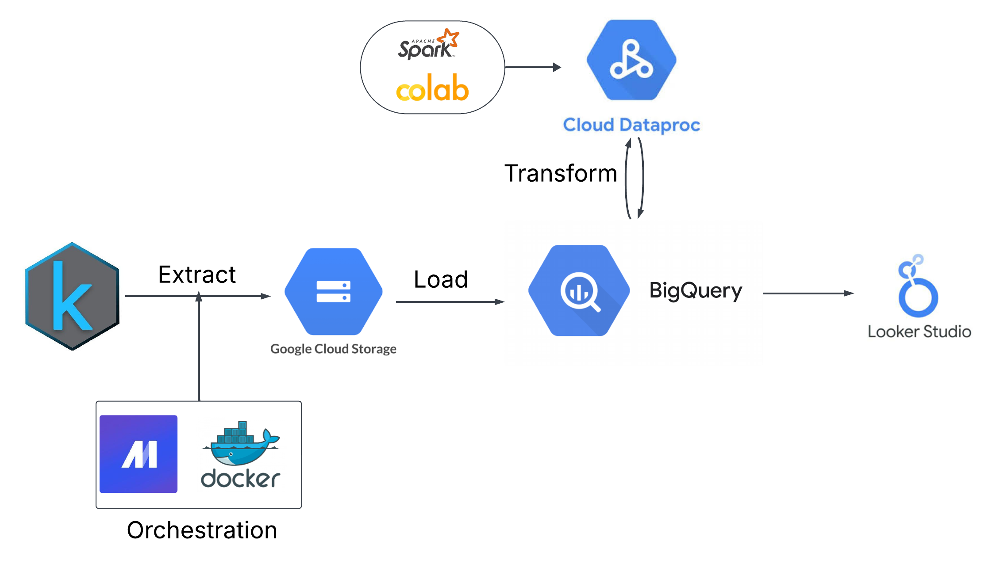
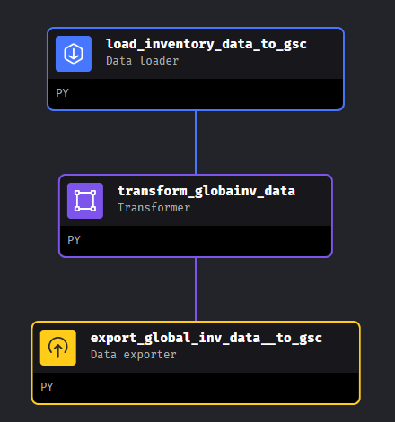
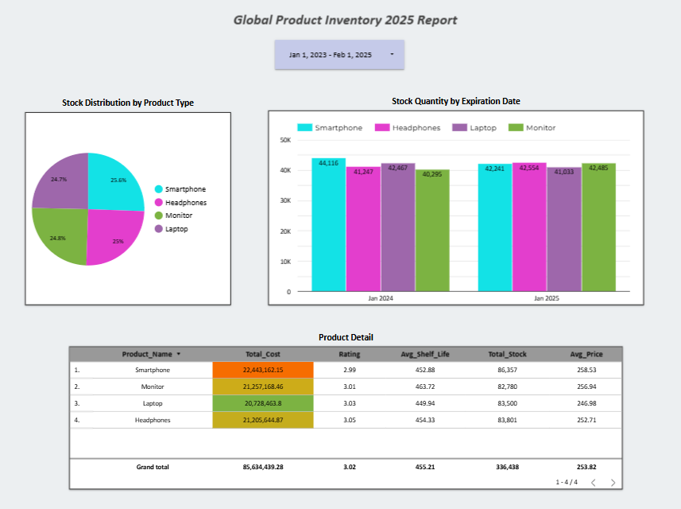

# Global Product Inventory Analysis

## Introduction
This Global Product Inventory Analysis project is an innovative end-to-end Data Engineering (DE) pipeline designed to streamline data handling and visualization. The workflow begins by sourcing data from Kaggle, followed by storing it securely in Google Cloud Storage. The data is then meticulously transformed to ensure accuracy and completeness before being loaded into BigQuery for efficient querying and analysis. To bring insights to life, the project leverages Looker Studio for creating visually compelling dashboards. With its well-orchestrated architecture, this project exemplifies the essence of modern data engineering by seamlessly integrating data ingestion, transformation, storage, and visualization into a unified solution.

## Project Description
### Problem Statement
The company is facing substantial financial losses due to an excessive stock of expired products. To address this issue, it is essential to analyze the comprehensive dataset, which includes details such as manufacturing and expiration dates, stock quantities, product ratings, and logistical attributes. By leveraging this data, the project aims to identify the root causes—whether stemming from supply chain inefficiencies, overordering, market fluctuations, or product-specific limitations—and develop actionable recommendations to optimize product storage and supply chain operations. Questions to begin:
* What is the financial loss over recent years?
* What is the customer satisfaction rate for each product?
* Which product has incurred the highest loss?
* What is the current stock of expired products?

### Dataset Description
This dataset provides a comprehensive overview of global product inventory, making it an invaluable resource for optimizing logistics, analyzing e-commerce trends, or conducting supply chain research. It features 14 detailed columns, including unique identifiers such as Product ID and descriptive attributes like Product Name, Category, and Description. Key metrics such as Price, Stock Quantity, and Warrantly Period are included, alongside logistical details like Product Dimensions, Manufacturing Date, and Expiration Date. The dataset also tracks inventory using SKU codes, highlights customer preferences with Product Rating, and offers insights into Color/Size Variations and Product Tags. [Dataset](https://www.kaggle.com/datasets/keyushnisar/global-product-inventory-dataset-2025/data)
### Tools
* **Mage**: workflow orchestration for ingesting data, transforming, and exporting to data lake
* **Docker**: containerizing mage
* **Google Cloud Storage**: storage data
* **Colab**: generate python script for Spark
* **Spark**：transform and partition the dataset
* **Google Bigquery**: performi SQL analytical queries and storage structured data
* **Google Looker Studio**: create a dashaborad for visualization
### Architecture

### Data Pipeline 
* Mage Pipeline:
  
  api to gcs
  
  

  [load api data ](https://github.com/linhfk/Zoomcamp2025/blob/main/Global%20Product%20Inventory/mage%20code/export_global_inv_data__to_gsc.py): ingest data from Kaggle and specific the data types

  [transform data](https://github.com/linhfk/Zoomcamp2025/blob/main/Global%20Product%20Inventory/mage%20code/transform_data.py): lower the the case of Product ID and dropna rows

  [export data to gcs](https://github.com/linhfk/Zoomcamp2025/blob/main/Global%20Product%20Inventory/mage%20code/load_inventory_data_to_gsc.py): export data as parquet format to google cloud storage

  [trigger](https://github.com/linhfk/Zoomcamp2025/blob/main/Global%20Product%20Inventory/image/trigger.png)

* Spark & Bigquery

  [Spark Transformation and Save to Bigquery](https://github.com/linhfk/Zoomcamp2025/blob/main/Global%20Product%20Inventory/mage%20code/sparkcode_transform_bigquery.py): clean, transform, enrich columns. For example, create a shelf-lift colums and split Product Dimentions column to Length, Wideth, and Heihth

  [Commit to run Spark](https://github.com/linhfk/Zoomcamp2025/blob/main/Global%20Product%20Inventory/mage%20code/spark%20_command.py)

### Dashboard
Report analysis are in [here]([https://github.com/linhfk/Zoomcamp2025/blob/main/Global%20Product%20Inventory/image/Globlal_Inventory_Report.pdf](https://github.com/linhfk/Zoomcamp2025/blob/main/Global%20Product%20Inventory/image/Globlal_Inventory_Report.pdf))

### Key findings & Recommendation
**Findings:**
* The storage percentage of various products are approximately the same.
* Over the past two years, the total recorded loss amounted to $85,634,439.28, highlighting the urgent need for improved operational efficiency.
* A total of 336,438 units of expired products were reported, representing a significant challenge in inventory management.
* The average product rating over the last two years was 3.02, indicating room for improvement in quality and customer satisfaction.
* Smartphones had both the lowest rating and the highest quantity of expired stock, emphasizing a critical area for immediate corrective action.

**Recomemdation:**
* The low product rating indicates customer dissatisfaction. It is essential to identify the root causes and address them to improve the overall customer experience.
* A substantial stock of expired products has incurred considerable losses for the company. To mitigate such setbacks and ensure future operational efficiency, it is imperative to develop an optimized inventory strategy. Identifying the root causes—whether due to overordering, unfavorable market trends, or product limitations—will be vital in shaping a solution
* The storage distribution across various products is nearly uniform, suggesting a lack of competitive products. To gain a larger market share, we should focus on developing advantageous products that stand out.

